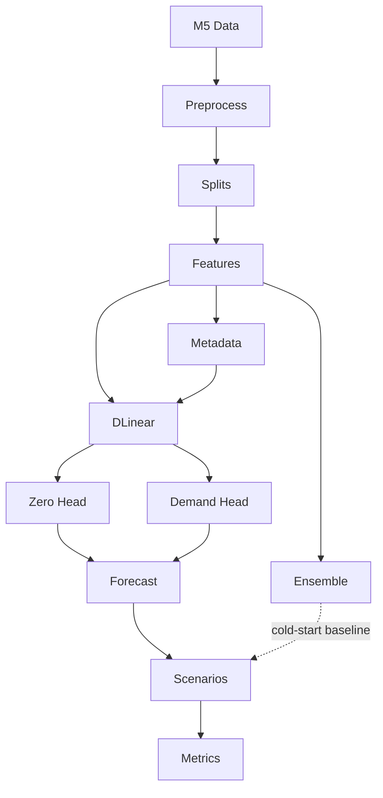

# Unified Forecasting Project

This project uses the M5 dataset to build a unified forecasting pipeline.

Implemented so far:

- preprocessing raw M5 data
- creating feature-engineered long-format data
- generating split metadata for intermittent demand and cold-start evaluation


## Pipeline



The diagram shows the conceptual flow. In the current scripts, feature engineering is run before split generation because splits are created from `m5_long_features.parquet`.

## Setup

Create the virtual environment and install dependencies:

```bash
uv venv
uv sync
```

## Data Location

Place the raw M5 CSV files in:

```text
data/m5/raw/
```

Expected files include:

- `calendar.csv`
- `sell_prices.csv`
- `sales_train_validation.csv`
- optionally `sales_train_evaluation.csv`
- optionally `sample_submission.csv`

## Preprocessing and Features

Scripts:

- `data/preprocess_sample.py`
- `data/features.py`

Create a small preprocessed sample:

```bash
uv run python data/preprocess_sample.py --data-dir data/m5/raw --output data/m5/preprocessed_10_sample.csv --num-items 10
```

Create the full preprocessed dataset:

```bash
uv run python data/preprocess_sample.py --data-dir data/m5/raw --output data/m5/preprocessed_all.parquet --all
```

Create the full feature-engineered dataset:

```bash
uv run python data/features.py --input data/m5/preprocessed_all.parquet --output data/m5/processed/m5_long_features.parquet
```

Optional sample feature CSV:

```bash
uv run python data/features.py --input data/m5/preprocessed_10_sample.csv --output data/m5/processed/m5_10_features.csv
```

## Split Metadata

Script:

- `data/splits.py`

Generate split metadata:

```bash
uv run python data/splits.py --input data/m5/processed/m5_long_features.parquet --output-dir data/m5/processed/splits
```

This creates:

- `intermittent_series.csv`
- `cold_start_item_series.csv`
- `cold_start_store_series.csv`
- `normal_series.csv`
- `combined_exclusive_series.csv`
- `heldout_items.csv`
- `heldout_stores.csv`

## Generated Outputs

Processed files can be large. Parquet is recommended for full M5 outputs.

Generated data files should generally not be committed unless needed for a specific review.
